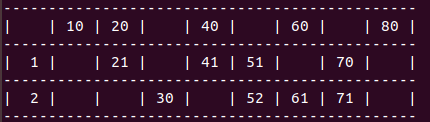

# HOUSIE TICKET GENERATOR (Ruby)

## **About**

A housie ticket is a 3x9 matrix that has exactly 15 unique numbers within the range of 1 to 90.

***

### **Rules:**

1. Each row can have eaxctly 5 numbers.
2. Each column can have 1 to 3 numbers.
3. Each column is assigned a range of numbers.
    * Column 1 range: [0 to 9]
    * Column 2 range: [10 to 19]
    * Column 3 range: [20 to 29]
    * Column 4 range: [30 to 39]
    * Column 5 range: [40 to 49]
    * Column 6 range: [50 to 59]
    * Column 7 range: [60 to 69]
    * Column 8 range: [70 to 79]
    * Column 9 range: [80 to 90]
4. Numbers must be arranged in ascending order from top to bottom in a column.

***
\

